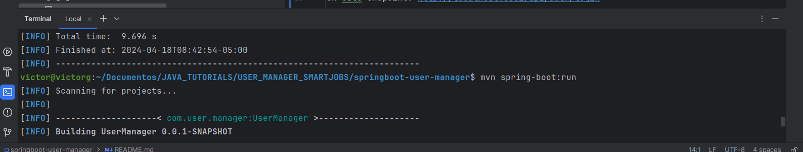

# UserManager SpringBoot app

instrucciones

version java 11 en adelante
maven instalado

*correr: mvn clean install en la raiz del proyecto
para limpiar el proyecto e instalar las librerias necesarias

- despues: mvn spring-boot:run
para correr el proyecto

*se obtiene el token jwt generado de forma simple
mandando el usuario: victorg
en este endpoint: http://localhost:8081/api/auth/login

quedando de esta forma en postman

* despues se copia ese token y se pega en la parte de authorization bearer token:
endpoint: POST - http://localhost:8081/api/user

al enviar el usuario queda guardado respondiendo el servicio lo siguiente

*se pueden acceder a todos los usuarios en el endpoint
http://localhost:8081/api/user/all

* url de servicios en swagger
http://localhost:8081/api/swagger-ui/index.html

* diagrama de la solucion
* https://drive.google.com/file/d/1vrF7pNX4vGa4oOQzMUTPXKyw8K-N4ROr/view?usp=sharing

*tambien se agrega la coleccion de postman con los request del servicio
[SmartJobs_Test.postman_collection.json](evidence%2FSmartJobs_Test.postman_collection.json)

 

